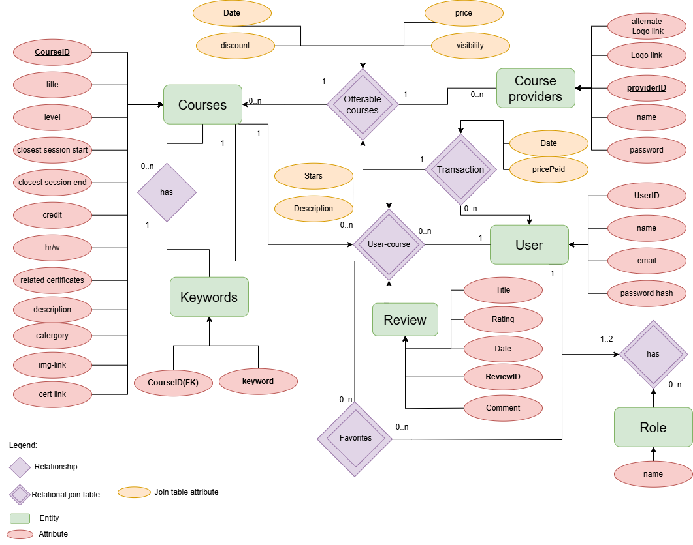
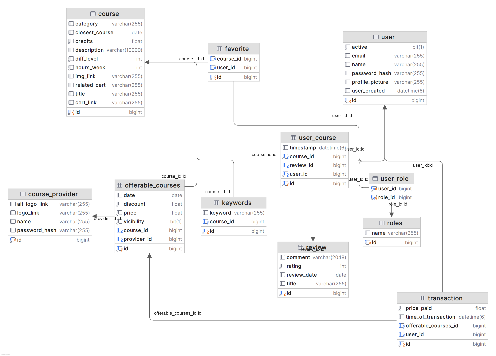

# Learniverse application backend

This repository contains the backend code for our Learniverse application.

The application is built using Spring boot for JAVA, and it is designed to be a RESTful API.We use NGINX to serve
images to the frontend, and we have a mySQL database to store data needed for the application.JPA is used to connect
the application to the database.The application is designed to be deployed with Docker, and we have a Dockerfile and
docker - compose file to facilitate this.

## Contributors:
- Signe B.Ekern (SigneBek)
- Matthew R.Hunt (matrHS)
- August D.Oksavik (AugOks)

## Legal
This website is a result of a university group project, performed in the course [IDATA2301 Web
technologies](https://www.ntnu.edu/studies/courses/IDATA2301#tab=omEmnet), at [NTNU](https://www.ntnu.no/).
All the information provided here is a result of imagination.Any resemblance with real companies or products is a
coincidence.

## Description

In this project, we have created a web application for a make - believe company called Learninverse.The idea is to
emulate a real - life situation with the specification from a customer.The primary purpose of the portal
is to help visitors compare prices and find the best supplier for their desired course.While company
information should be available, the main focus is product search.The portal is designed to be user - friendly and
easy to navigate, as well as give the impression of a serious learning portal meant for professionals.


## Getting Started
To get started with the application, you will need to have docker installed on your machine, such as docker desktop.
For correct connections of the application to the database, ensure that a.env file is present in your downloaded
repository and that the.env file contains these parameters:

```
MYSQL_DATABASE='learniverse'
MYSQL_PASSWORD='password'
MYSQL_ROOT_PASSWORD='verysecret'
MYSQL_USER='user1'

JWT_SECRET_KEY=SomeJWTSecretKeyThatIsVerySecureAndLong
USE_HTTPS=true
SSL_KEYSTORE_PATH=certs/local/keystore.p12
SSL_KEYSTORE_PASSWORD=changeit
SSL_KEY_ALIAS=springboot
````

A certificate is required for the application to run with HTTPS. The certificate is included in the repository
and is only intended for development purposes. It is not secure and should not be used in production.

Along with this, a SQL file is included in the repository. This file is used to create the database and tables
necessary for normal operation of the application. The SQL file is located in root and is named `init.sql`.

## Running the Application

- Clone the application using ssh: git@github.com:NTNUFrokostklubben/IDATA2306.git
- Create a .env file in the root of the project and copy the parameters above into it.


Open the root folder in a terminal and run the application using docker-compose:
```bash
docker - compose up--build
  ```
NB! It may be necessary to run this twice to ensure that the database is created.

once the docker container is running properly, start a new terminal and
copy the `init.sql` file to the relevant container:
```bash
 docker cp init.sql learniverse - mysql:/init.sql
  ```
once the file has been copied, enter the container: NB! container must already be running.
```bash
  docker exec - it  learniverse - mysql bash
  ```
Once inside the container, log in to MySQL by running:
```bash
mysql - u root - p
  ```
the password here is the MYSQL_ROOT_PASSWORD from the .env file.

Once inside mysql, run:
```sql
    USE learniverse;
  SOURCE init.sql;
```
Assuming all changes went through with no errors, make sure to commit changes before leaving:
```sql
COMMIT;
```
Now that the database is created, initialized and running, it is possible to see all exposed API endpoints using
swagger: https://localhost:8080/api/swagger-ui/index.html#/

Before authorized endpoints can be tested or used, it is necessary to generate a JWT token, which can be done by
logging into the default users created in the database. The default users are:

```
#admin
email: Chuck @gmail.com
password: Nunchucks2024
#user
email: dave @gmail.com
password: Dangerous2024
  ```

Using the Authenticate endpoint, a JWT token can be generated. This token is then used to authorize all other endpoints
https://localhost:8080/api/swagger-ui/index.html#/authentication-controller/authenticate.

****

## Database


